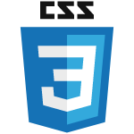

## Hi there! 👋

I'm a Backend Engineer who is passionate about learning and exploring the ever-evolving world of technology. I'm always eager to tackle new challenges and strive to stay up-to-date with the latest advancements in the field.

Interests:
Apart from coding, I enjoy playing computer and mobile games on my free time. 🎮🎮

Let's connect!
If you're interested in connecting with me and discussing all things tech, feel free to reach out! https://www.linkedin.com/in/ralph-fuentes/, https://www.facebook.com/rhapnex

## Tools & Languages: 

